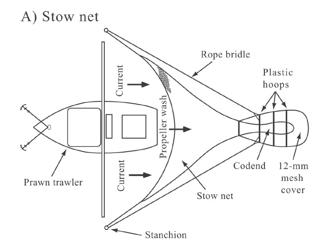

## Summary

**This case study demonstrates:**

-   Fitting of logistic and Richards selection curves to covered-codend data. 
-   Handling sub-sampled data.
-   Using combined individual-haul data to estimate over-dispersion (due to
    causes such as sub-sampling, between-haul variability and non-independent
    behaviour of fish).
-   Using the bootstrap and over-dispersion adjustments.
-   BONUS section: Fitting a semi-parametric spline selection curve.

### Data source

The data are for school prawn selectivity in a 30 mm square-mesh stow-net trawl
(MacBeth et al. 2005. Improving selectivity in an Australian penaeid stow-net
fishery. Bulletin of Marine Science, 76: 647-660).

```{r, echo=F, out.width="400px"}
knitr::opts_chunk$set(fig.height = 3.5)

```

### Load required packages

```{r, warning=F, message=F, echo=-1}
#devtools::install_github("rbmillar/SELECT")
require(SELECT)
require(dplyr)
```

### Input the data

```{r}
#Read in data and remove zero catch lengths
Stow.df=read.csv("../Data/LgSq.csv",header=T) #343 rows
Stow.df=subset(Stow.df,total>0) #213 rows

#Quick peek at data
head(Stow.df)
```

Note the sampling fractions `qcodend` and `qcover` - the catch was sub-sampled.

### Define variable names, and the names of sampling fraction variables

```{r}
v.names=c("lgth","cover","codend")
q.fracs=c("qcover","qcodend")
```

### Produce a plot of retention proportions

```{r}
Tots=Raw2Tots(Stow.df,v.names,q.fracs)
Tots=transform(Tots,n=codend+cover,y=codend/(codend+cover)) 
Tots
plot(y~lgth,data=Tots) #las=1 gives horizontal y tick values
```

### Fit a logistic selection curve, plot it, and do model checks

```{r}
Logist.fit=SELECT(Stow.df,var.names=v.names,q.names=q.fracs)
plot(Logist.fit, xlab="Carapace length (mm)")
ModelCheck(Logist.fit, xlab="Carapace length (mm)")
Estimates(Logist.fit)
```

The logistic fit estimates `L50` and `SR` of 16.1 and 4.7 mm, respectively.
However, the deviance residual plot does suggest some mild lack of fit due to
blocks of positive residuals. So, let's try an asymmetric Richards curve fit.

### Fit a Richards selection curve

```{r}
Rich.fit=SELECT(Stow.df,var.names=v.names,q.names=q.fracs,stype="richards")
plot(Rich.fit, xlab="Carapace length (mm)")
ModelCheck(Rich.fit, xlab="Carapace length (mm)")
Estimates(Rich.fit)
```

The Richards fit eliminates the pattern in the residuals. The Richards fit
estimates `L50` and `SR` of 16.2 and 5.2 mm, respectively. Note the asymmetry in
L25 and L75 around L50.

## Correcting for over-dispersion

**CAUTION:** The log-likelihood and AIC from these fits to the summed data can
**not** be used for inference because over-dispersion due to between-haul
variation is likely and has not been taken into account. **BHV can not be
detected from the summed data**

### Produce a lattic plot of retention proportions by haul

```{r, fig.height=5}
HaulCatch=Raw2Tots(Stow.df,v.names,q.fracs,sumHauls=F)
HaulCatch=transform(HaulCatch,n=codend+cover,y=codend/(codend+cover)) 
require(lattice) #For xyplot
xyplot(y~lgth | Haul,data=HaulCatch)
```

Indeed, considerable between-haul variation is present.

### Fit a Richards selection curve to the combined individual haul data

```{r}
Rich.fit2=SELECT(Stow.df,var.names=v.names,q.names=q.fracs,stype="richards",
                sumHauls=F)
ModelCheck(Rich.fit2, xlab="Carapace length (mm)", minE=5, plots=F)
```

The variance correction factor `Pearson.CF` shows that the actual variabilty is
about 11 times that assumed under the binomial model.

This correction factor could be used to adjust the AICs to compare the logistic
to the Richards fits. *(To be completed)*

With this amount of variability a bootstrap should be reasonable.

### Define function to return quantities of interest: L25, L50, L75 and SR

```{r}
ParFunc=function(data,var.names) {
  Rich.fit=SELECT(data,var.names,q.names=q.fracs,stype="richards")
  Estimates(Rich.fit)[1:4,"par"]
}
#Check that it works
ParFunc(Stow.df,v.names)
```

### Implement a bootstrap

```{r Bootstrap}
nsim=100 #Using nsim=100 for demonstration. Set to at least 1000 in practice
BootPars=bootSELECT(Stow.df,v.names,ParFunc,haul="Haul",paired=T,nsim=100)
cat("Bootstrap estimated standard errors are",apply(BootPars,2,sd))
```

## Bonus analysis

The Richards fit does estimate somewhat high retention for very small prawns, so
here we explore whether the performance of a semiparametric fit using the
`SELECT` function `SplineSELECT`.

### Fit a spline selectivity curve

```{r, message=F, warning=F}
require(mgcv)
Spline.fit=SplineSELECT(Stow.df,var.names=v.names,q.names=q.fracs)
plot(Tots$lgth,resid(Spline.fit),type="h")
abline(h=0)
plot(y~lgth,data=Tots,xlab="Carapace length (mm)")
points(Tots$lgth,fitted(Spline.fit),type="l")
AIC(Spline.fit)
```

The spline fit has almost identical AIC as the Richards fit. It does a better
job of fitting the proportions at the smaller carapace lengths.
